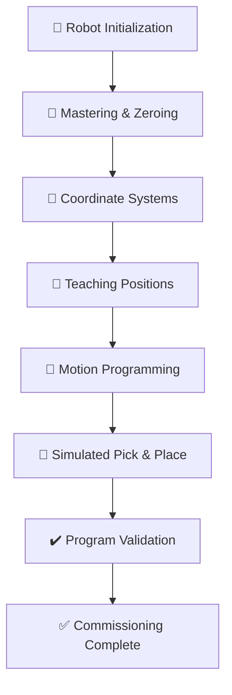
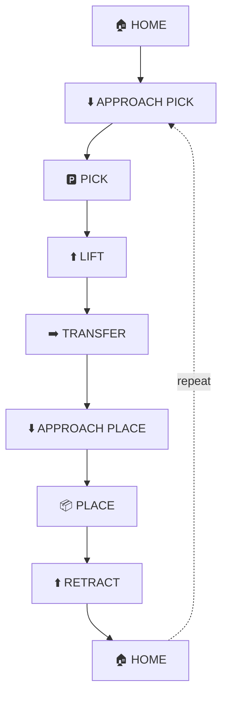

<!-- HERO BANNER: replace with one large professional photo of the robot -->

  

<h1 align="center">FANUC Industrial Robot Programming & Commissioning</h1>

  Setup, programming, and commissioning of an industrial FANUC robot, taken through the full plant-floor workflow from power-up and mastering to a simulated pick-and-place motion sequence.

  
  
  
  
  
  

---

## Short Description

This project covers the setup, programming, and commissioning of an industrial FANUC robot, worked through the same order an engineer follows on the plant floor: power up and master the robot, configure coordinate systems, teach positions, build a motion program, and prove it out. The robot runs a simulated pick-and-place sequence built from programmed waypoints. No end-of-arm tooling was installed, so nothing is physically picked up. Instead, the arm follows the exact motion path a production cell would run before a gripper is integrated.

---

## 🎥 Demo

### Pick and Place Walkthrough

The robot running the full simulated pick-and-place waypoint sequence start to finish.

### Tutorial: Adding a New Position

A step-by-step tutorial on teaching and adding a new position into the program on the teach pendant.

---

## 📌 Overview

Industrial robots are the workhorses of modern manufacturing. They weld car bodies, tend CNC machines, palletize boxes, and move parts between stations all day, with motion that repeats to a fraction of a millimeter. A six-axis arm like this one can be set up for almost any repetitive task on a line.

FANUC is one of the most common robot brands on the plant floor, especially in automotive. Around Windsor, places like Stellantis and the tier suppliers run them heavily, so knowing how to set one up, program it, and bring it online is a core skill for anyone heading into controls or automation.

Commissioning is everything that happens before a robot runs production: powering up, mastering, configuring frames, teaching positions, and proving out the motion. It is the difference between a robot sitting in a crate and one that is ready to run a cell. This project walks through that whole process.

---

## 🎯 Project Objectives

- Bring an industrial FANUC robot up safely from power-on
- Master and zero the robot correctly
- Configure Joint, World, Tool, and User coordinate systems
- Teach and store repeatable positions
- Build a motion program on the teach pendant
- Run a simulated pick-and-place sequence from waypoints
- Validate repeatable, fault-free motion

---

## ⭐ Project Highlights

| Item | Detail |
|------|--------|
| **Robot** | Industrial FANUC 6-axis arm |
| **Interface** | Teach Pendant (TP) programming |
| **Coordinate Systems** | Joint, World, Tool, User frames |
| **Motion** | Joint and Linear moves with FINE / CNT termination |
| **Application** | Simulated pick-and-place (waypoint-based, no tooling installed) |
| **Focus** | Commissioning, motion programming, repeatability |

---

## 🔄 System Workflow

---

## 🖼️ Project Gallery

|  |  |  |
|:---:|:---:|:---:|
| **Robot** | **Robot Workcell** | **Mastering & Zero Position** |

---

## 🛠️ Robot Commissioning Workflow

### Robot Initialization

Before touching a program, the robot has to come up safely. The controller powers on, you check for active faults, and enable servo power so the motors can hold and move the arm. The safety circuit (E-stop, fence, and the deadman on the pendant) has to be healthy or the servos will not enable. Once it is up, you send the arm to a known home position so every session and every cycle starts from the same place.

With the robot up and safe, the next thing is making sure it actually knows where it is.

### Robot Mastering & Zeroing

Mastering is how the robot knows where its joints really are. Each axis has a reference mark, and mastering ties the encoder counts to those marks so the controller's idea of position matches reality. It matters because every taught position is stored relative to that reference. If mastering is off, the whole program is off.

If mastering is lost, from a dead encoder battery, a motor swap, or certain faults, the robot cannot run its program until it is re-mastered, because it no longer trusts its own position.

Mastering is not the same as Zero Position. Mastering is the one-time calibration of the encoders. Zero Position is just a known pose, all axes at zero degrees, that you can jog to for a reference. You master once, and you visit zero whenever you want a clean starting pose.

### Coordinate Systems

You move and program the robot in different coordinate systems depending on what you are doing. The skill is not defining them, it is knowing which one makes a given move easy instead of painful.

- **Joint** moves one axis at a time. You reach for it to get the arm out of an awkward pose, work near a hard stop, or move around a singularity where straight-line moves get twitchy.
- **World** is fixed to the robot base, the X, Y, Z of the room. Good for simple jogging when you just need the tool to go up, over, or across.
- **Tool** aligns X, Y, Z to the tool tip. This is what you use to approach or back straight off a part along the tool direction, like lifting cleanly off a pick without dragging.
- **User** is a frame tied to the work, a fixture, pallet, or conveyor. You teach points in this frame so that if the fixture moves, you re-teach the frame and every point follows it.

### Teaching Positions

Teaching a position is just driving the robot exactly where you want it and recording that pose. Points can live inside the TP program or in Position Registers (PRs) that several programs can share. When a point drifts or a fixture shifts, you Touch Up, re-record that one point without rewriting the program.

All of this rides on repeatability. Because the robot returns to the same encoder counts every time, a taught point holds for thousands of cycles. That is what lets you teach once and trust it.

### Motion Programming

Motion instructions are where the robot's behavior actually lives: whether it moves fast between poses or slow and exact, and whether it blends through a point or stops dead on it. The main choices are Joint (J) versus Linear (L) moves, and FINE versus CNT termination.

> **This section will be written around my actual TP program (shown above).** I will break down the real program here, the J and L moves I used, where I chose FINE versus CNT, and the motion path, and explain the reasoning behind each choice instead of describing FANUC programming in general.

### Simulated Pick-and-Place Cycle

This is the centerpiece of the project. The robot runs a full pick-and-place motion sequence built from programmed waypoints. No gripper is installed, so nothing is physically grasped, but the arm moves through the exact path a production cell would follow.

Engineers simulate motion like this all the time before tooling shows up. It lets you prove out the path, reach, clearances, and cycle time early, so when the gripper and parts arrive you are only tuning the grasp, not fixing the motion. Building it this way mirrors how a real cell is brought online in stages.

### Program Validation

Validation is running the sequence enough times to trust it. I stepped through the program slow first to check each point, then ran repeated cycles at speed to confirm the arm hits the same positions every time. I watched for smooth motion with no jerks or odd reorientations at the blends, and confirmed the program runs start to finish with no faults. Once it repeats cleanly cycle after cycle, it is ready for the next stage: adding tooling.

---

## 🧠 Engineering Challenges

- Getting a real feel for the coordinate systems and knowing when to reach for Joint, World, Tool, or User.
- Choosing Joint versus Linear moves so the path is both efficient and correct where it matters.
- Programming motion that repeats cleanly every cycle.
- Keeping the motion smooth through blends instead of jerky or twitchy.
- Learning the order commissioning actually happens in, so steps are not done out of sequence.

---

## ✅ Testing & Validation

| Check | Status |
|-------|:------:|
| Robot startup and servo enable | ✅ Verified |
| Mastering and zero position | ✅ Verified |
| Joint and Cartesian jogging | ✅ Verified |
| Tool and User frame configuration | ✅ Verified |
| Taught positions repeatable | ✅ Verified |
| Motion program runs fault-free | ✅ Verified |
| Full cycle repeats across runs | ✅ Verified |

---

## 📈 Results

- Brought an industrial FANUC robot up safely and confirmed mastering
- Configured Joint, World, Tool, and User coordinate systems
- Taught repeatable positions and used Touch Up to correct points
- Built a teach pendant motion program from waypoints
- Ran a simulated pick-and-place cycle that repeats cleanly
- Validated smooth, fault-free motion across multiple runs

---

## 🧰 Technical Skills Demonstrated

---

## 🚀 Future Improvements

- Install a real pneumatic or electric gripper and add the grasp to the cycle
- Integrate a PLC and hand off control over EtherNet/IP
- Add machine vision for part detection and alignment
- Develop conveyor tracking so the robot picks from a moving line
- Extend into machine tending and palletizing routines
- Wire in digital I/O for end-of-arm tooling and cell devices

---

## 👤 About Me

**Anil Pantula**, Electrical Engineering Student and Automation Technician, hands-on with industrial controls and robotics.

Interested in Industrial Automation, Controls Engineering, Industrial Robotics, PLC Programming, and Manufacturing Systems.

<!-- Add your links -->
- GitHub: [github.com/your-username](https://github.com/your-username)
- LinkedIn: [linkedin.com/in/your-profile](https://linkedin.com/in/your-profile)

Engineering portfolio project documenting industrial robot programming and commissioning.

