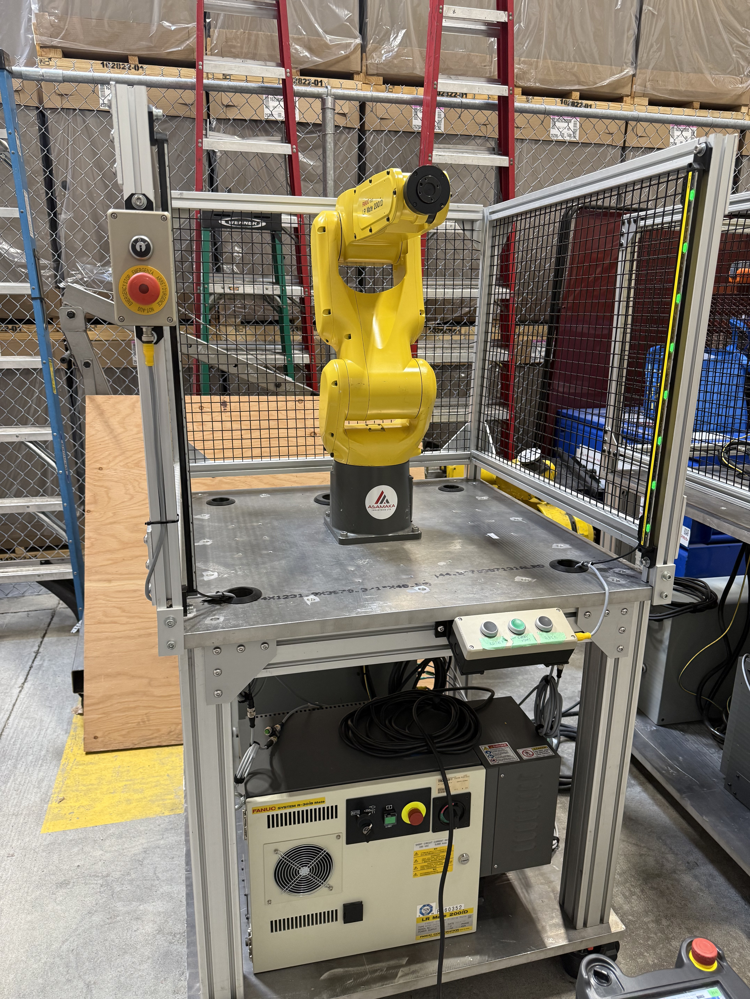
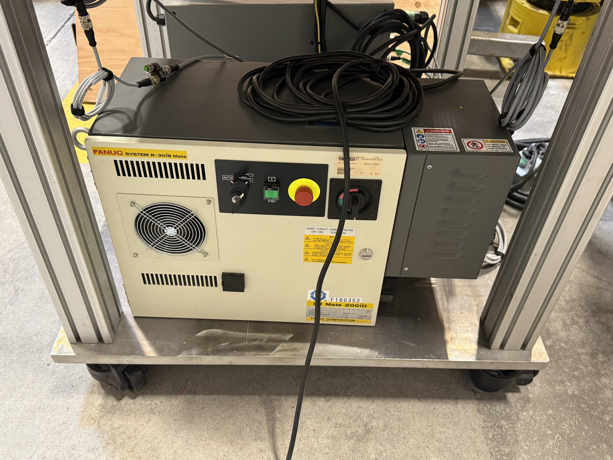
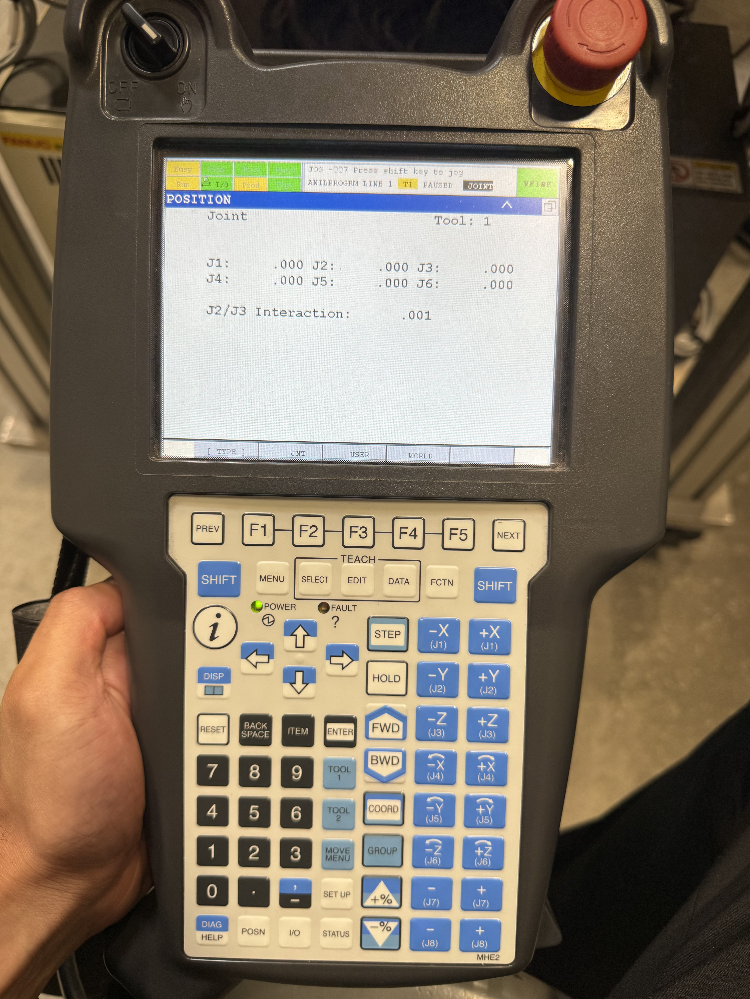
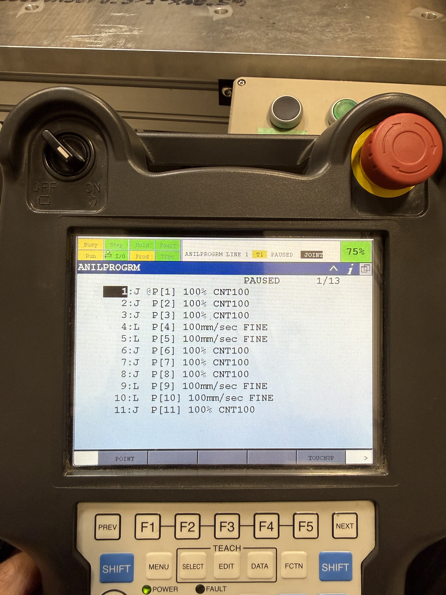
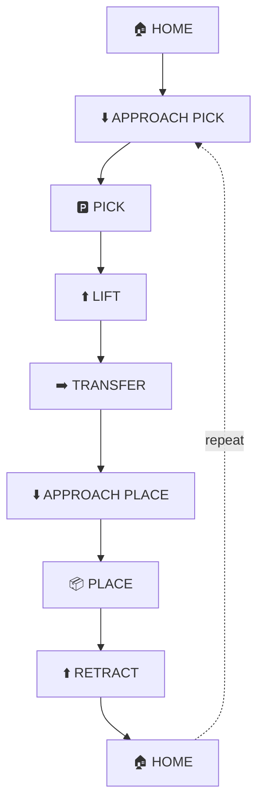

Fanuc robot readme · MD
<!-- HERO BANNER: one large photo of the robot -->
<p align="center">
  
</p>
<h1 align="center">FANUC Industrial Robot Programming & Motion Control</h1>
 
<p align="center">
  Hands-on programming and operation of a six-axis FANUC industrial robot using teach-pendant programming, coordinate systems, taught positions and waypoint-based pick-and-place motion.
</p>
<p align="center">
  
  
  
  
  
  
</p>
---
 
## Overview
 
This project documents hands-on programming and operation of a six-axis FANUC industrial robot using the teach pendant. The work included robot mastering and zeroing, jogging in multiple coordinate systems, teaching positions and developing a waypoint-based motion program.
 
The final program performs a simulated pick-and-place sequence consisting of approach, pick, lift, transfer, place and retract positions. No end-of-arm tooling was installed, so the project focuses specifically on robot setup, positioning and motion programming rather than physical part handling.
 
---
 
## Robot Demonstration
 
### Simulated Pick-and-Place Sequence
 
[](https://youtube.com/shorts/jubZ4s0ePbc)
 
### Teaching a New Position
 
[](https://youtube.com/shorts/QktO_CybM7o)
 
---
 
## Robot & Software
 
- **Robot:** FANUC six-axis industrial robot
- **Interface:** FANUC Teach Pendant
- **Programming:** TP (teach pendant) programming
- **Motion:** Joint and Linear moves with CNT and FINE termination
<p align="center">
  
</p>
---
 
## Programming Workflow
 
**1. Mastering & Zeroing** — Confirmed the robot's joint mastering so the controller's position matches the physical arm, and used the zero position as a known reference pose. Every taught point depends on this being correct.
 
<p align="center">
  
</p>
**2. Jogging & Coordinate Systems** — Jogged the arm in joint and Cartesian coordinate systems, choosing whichever system made a given move easiest, joint to get out of awkward poses, Cartesian for straight, intuitive moves.
 
**3. Teaching Positions** — Drove the robot to each location and recorded it as a positional point (`P[n]`). The routine is built from taught points rather than typed-in coordinates.
 
**4. Motion Programming** — Built the sequence from Joint and Linear moves on the teach pendant, choosing the move type and termination (CNT or FINE) for each point based on whether speed or accuracy mattered.
 
**5. Pick-and-Place Sequence** — Ordered the points into a full approach, pick, lift, transfer, place, retract and return-home cycle.
 
**6. Testing & Validation** — Stepped through the program point by point, then ran it start to finish to confirm it repeats the same path.
 
---
 
## Actual TP Program
 
<p align="center">
  
</p>
The program (`ANILPROGRM`, 13 lines) is built from two kinds of moves:
 
```
 1:  J  @P[1]  100%       CNT100
 2:  J   P[2]  100%       CNT100
 3:  J   P[3]  100%       CNT100
 4:  L   P[4]  100mm/sec  FINE
 5:  L   P[5]  100mm/sec  FINE
 6:  J   P[6]  100%       CNT100
 7:  J   P[7]  100%       CNT100
 8:  J   P[8]  100%       CNT100
 9:  L   P[9]  100mm/sec  FINE
10:  L   P[10] 100mm/sec  FINE
11:  J   P[11] 100%       CNT100
```
 
**Joint moves (`J`, 100%, `CNT100`)** carry the arm quickly between general positions. `CNT100` blends through the point without stopping, so the robot rounds the corner and keeps moving. These handle the fast travel through open space.
 
**Linear moves (`L`, 100 mm/sec, `FINE`)** drive the tool in a straight line at a controlled speed. `FINE` makes the robot stop exactly on the point. These are used where accuracy matters, the straight approach into a pick and into a place, so the points `P[4]`–`P[5]` and `P[9]`–`P[10]` are the pick and place pairs, with joint moves carrying the arm between them and back home.
 
That is the core idea behind the whole routine: fast blended joint moves to get into position, precise linear moves to land on the pick and place points.
 
---
 
## Motion Sequence
 

 
---
 
## Testing & Results
 
- Confirmed mastering and a repeatable zero/home position
- Jogged and positioned the arm in joint and Cartesian coordinate systems
- Taught the full set of positional points used by the program
- Built a 13-line motion program mixing Joint and Linear moves
- Ran the simulated pick-and-place sequence start to finish
- Verified the robot repeats the same path across multiple runs
---
 
## Engineering Takeaways
 
- Learned how coordinate-system selection changes the way an operator can efficiently position a six-axis robot.
- Developed a structured approach to teaching approach, process and retract positions rather than moving directly between endpoints.
- Learned when to use CNT versus FINE termination: blended joint moves for fast travel, FINE linear moves where the arm has to land accurately.
- Practiced building robot motion incrementally and validating individual positions before running the complete sequence.
---
 
## Production-Cell Integration
 
The current project focuses on robot motion without end-of-arm tooling. A production implementation could extend the system with:
 
- PLC-to-robot handshaking over EtherNet/IP
- Digital I/O for gripper control and confirmation
- Part-present and fixture sensors
- Machine-vision-based part localization
- Conveyor synchronization
- Cell-level permissives, faults and recovery logic
This is where the robot work connects to my PLC and HMI experience: the motion is proven, and the next step is wrapping it in the cell control around it.
 
---
 
## About
 
**Anil Pantula**
Electrical Engineering Student | Controls & Automation
 
Hands-on experience with PLC programming, HMI development, industrial robotics and automation systems. Interested in controls engineering, industrial automation, robotics, power, and PCB design.
 
<!-- Add your links -->
- GitHub: [github.com/AnilPantula](https://github.com/AnilPantula)
- LinkedIn: [linkedin.com/in/your-profile](https://linkedin.com/in/your-profile)
 
