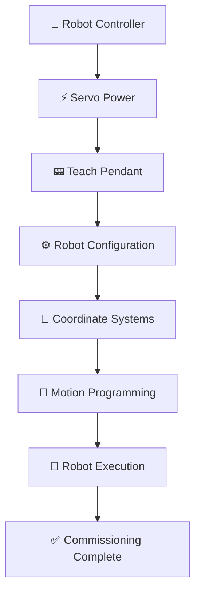

<!-- HERO BANNER: replace with a large photo of the FANUC robot -->

  

<h1 align="center">FANUC Industrial Robot Programming & Commissioning</h1>

  Programming, configuration, and commissioning of an industrial FANUC robot using standard teach pendant workflows: coordinate systems, motion programming, position teaching, mastering, and alarm recovery.

  
  
  
  
  
  
  
  
  

---

## 📌 Overview

FANUC is one of the largest industrial robot builders in the world, and their arms are everywhere in manufacturing: welding, material handling, assembly, machine tending, and palletizing. Most automotive plants run them by the hundreds.

Commissioning is the work that happens before a robot ever touches production. It covers powering up the controller, configuring the robot, setting up coordinate systems, teaching positions, and proving out motion. Get this part wrong and the robot either faults out or moves somewhere you didn't intend.

Programming matters because a robot is only as good as the paths it's taught. Clean, repeatable motion is what lets a cell hold cycle time and quality shift after shift. This project walks through that programming and commissioning workflow on a FANUC arm.

---

## 🎯 Project Objectives

- Configure an industrial FANUC robot from power-up
- Program repeatable robot motion
- Learn the industrial robot commissioning workflow
- Configure tool and user coordinate systems
- Teach and store robot positions
- Understand industrial robot safety
- Practice startup and fault recovery procedures
- Build practical, hands-on robot programming skills

---

## ✨ Project Highlights

- ✔ Robot commissioning
- ✔ Teach pendant programming
- ✔ Joint motion
- ✔ Linear motion
- ✔ Tool frame configuration
- ✔ User frame configuration
- ✔ Position teaching
- ✔ Motion program development
- ✔ Robot mastering
- ✔ Alarm recovery
- ✔ Industrial robotics workflow

---

## 🔄 System Workflow

---

## 🖼️ Gallery

<!-- Drop photos into /Images. Replace the placeholders below. -->

|  |  |  |
|:---:|:---:|:---:|
| **Full Robot** | **Robot Controller** | **Teach Pendant** |
| The industrial FANUC arm. | The FANUC controller running the robot. | The programming and jogging interface. |

|  |  |  |
|:---:|:---:|:---:|
| **Home Position** | **Joint Jogging** | **Cartesian Jogging** |
| Robot at a known, ready position. | Driving one axis at a time. | Moving the tool point along X, Y, Z. |

|  |  |  |
|:---:|:---:|:---:|
| **Tool Frame Setup** | **User Frame Setup** | **Position Registers** |
| Control point set at the tool tip. | Coordinate system tied to the work. | Taught positions stored for reuse. |

|  |  |  |
|:---:|:---:|:---:|
| **Motion Program** | **Robot Executing Motion** | **Alarm Recovery** |
| The taught motion routine. | The arm running the program. | Reading and clearing a fault. |

|  | | |
|:---:|:---:|:---:|
| **Robot Workspace** | | |
| The overall workcell. | | |

---

## 🛠️ Programming Workflow

### Robot Startup

Before any programming, the controller is powered up and servo power is enabled. You clear any startup faults, confirm the robot is at a known position, and check that the teach pendant is active and the E-stop chain is healthy. Nothing moves until the robot is in a safe, known state.

### Robot Jogging

Jogging is manually driving the robot from the teach pendant. Joint mode moves one axis at a time, which is how you get the arm out of an awkward pose or away from a hard stop. Cartesian mode (World or Tool) moves the tool point in straight lines along X, Y, and Z, which is how you line up to a real feature. You need both: joint mode for gross positioning, Cartesian for precise, intuitive moves.

### Teaching Positions

Once the arm is where you want it, that position gets recorded. FANUC stores these as position registers or as points inside the program. Because the robot returns to the same encoder counts every time, taught positions repeat to a fraction of a millimeter. That repeatability is the whole point: teach it once and the robot hits it the same way every cycle.

### Motion Programming

Motion instructions tell the robot how to get from point to point. Joint moves (J) let all axes move together on the fastest path, quick, but the tool path isn't a straight line. Linear moves (L) drive the tool point in a straight line at a set speed, which you use when the path matters, like approaching a part or tracing a surface. Most programs mix the two: joint through open air, linear where accuracy counts.

### Tool Frames

The robot is programmed relative to a tool frame, not the bare flange. The tool frame puts the control point at the actual working tip, so when the tool rotates, the robot pivots around that tip instead of the flange. No physical gripper was installed on this robot, but the tool frame was set up the same way you would before mounting real tooling. The workflow is identical to a production system.

### User Frames

A user frame is a coordinate system tied to the work, a fixture or a conveyor, instead of the robot base. Factories lean on them because you can teach every point relative to that frame. If the fixture moves, you re-teach the frame and all the points shift with it. That's what makes programs reusable and quick to recover after a changeover.

### Program Execution

With the positions taught and the moves programmed, the robot runs the program and follows the recorded path. You step through it slow first, then bring the speed up once the path looks clean. Good execution is smooth, no jerky transitions, and repeatable, the arm traces the same path every run.

### Mastering

Mastering is how the robot knows where its axes actually are. Each joint has a reference position, and mastering aligns the encoder counts to that known zero. You need it after a battery loss, an encoder fault, or certain maintenance. Without valid mastering, taught positions mean nothing, because the robot's idea of where it is would be off.

### Alarm Recovery

Robots fault, and part of commissioning is handling it. You read the alarm, work out the cause (over-travel, servo fault, collision guard), clear it safely, and jog the arm back to a good position before resuming. The goal is getting back to running without making the situation worse.

---

## 🧠 Engineering Challenges

- Getting a feel for the coordinate systems and how World, Tool, and User frames relate to each other.
- Reading robot orientation, wrist poses and near-singularity positions aren't obvious at first.
- Making motion smooth instead of jerky by choosing the right move types and speeds.
- Teaching paths that repeat cleanly every run.
- Learning the commissioning order so steps don't get done out of sequence.
- Keeping the robot operating safely throughout.

---

## ✅ Testing & Validation

The work was validated by actually running the robot through the full workflow:

- Configured the robot from power-up
- Jogged in joint and Cartesian coordinate systems
- Taught and stored positions
- Built and executed motion programs
- Verified the robot repeated the same path each run
- Tested startup and fault-recovery procedures
- Validated the tool and user frame configuration

No production deployment, PLC integration, or gripper testing was part of this project.

---

## 📈 Results

- Configured an industrial FANUC robot from startup
- Created repeatable robot motion programs
- Set up tool and user frames
- Built practical, hands-on commissioning experience
- Improved understanding of the industrial robotics workflow
- Practiced fault diagnosis and safe robot recovery

---

## 💡 Lessons Learned

- Robot safety comes first, and knowing the E-stop and recovery flow matters as much as the programming.
- Coordinate systems are the foundation, once the frames make sense, everything else gets easier.
- Commissioning has an order to it, and following that order saves a lot of rework.
- Smooth, repeatable motion comes from planning the path, not just teaching points.
- Small habits, clean naming, sensible speeds, safe approach points, make a program easier to run and recover.

---

## 🚀 Future Improvements

- Industrial gripper (end-of-arm tooling) integration
- PLC communication over EtherNet/IP
- Machine vision integration
- Conveyor tracking
- Pick-and-place operations
- Machine tending
- Palletizing
- Digital I/O integration
- Full automatic production cycle
- Robot cell safety devices

---

## 🧰 Skills Demonstrated

---

## 👤 About Me

Automation Technician and Electrical Engineering student, hands-on with industrial controls and robotics.

Interested in Industrial Automation, Controls Engineering, Industrial Robotics, PLC Programming, and Manufacturing Automation.

<!-- Add your links -->
- GitHub: [github.com/your-username](https://github.com/your-username)
- LinkedIn: [linkedin.com/in/your-profile](https://linkedin.com/in/your-profile)

Engineering portfolio project documenting industrial robot programming and commissioning.

