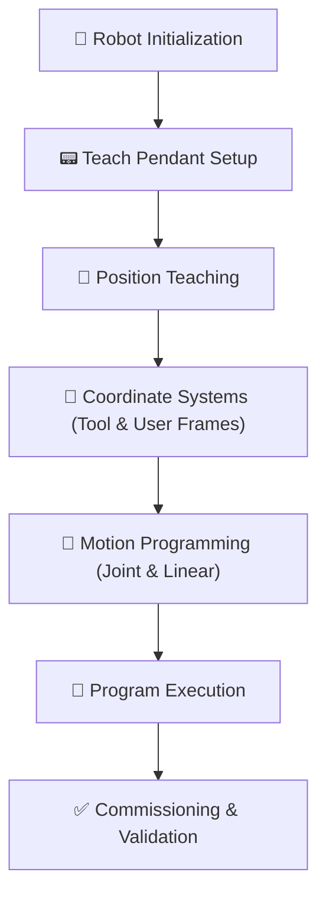

<!-- HERO BANNER: replace with a large photo of the robot -->

  

<h1 align="center">FANUC Industrial Robot Programming & Commissioning</h1>

  Programming, Commissioning, Motion Planning, and Industrial Robot Configuration using a FANUC Industrial Robot.

  
  
  
  
  
  

---

## 📌 Overview

This project documents the programming and commissioning of an industrial FANUC robot using standard manufacturing workflows. The focus was on robot configuration, teach pendant programming, motion planning, coordinate systems, and repeatable robot movement. Although no production end-of-arm tooling was installed, the robot was programmed using the same engineering practices used during industrial automation commissioning.

---

## 🎥 Demo

### Complete Robot Motion Sequence

<!-- 🎥 link or embed Videos/MotionSequence.mp4 -->
[▶ MotionSequence.mp4](Videos/MotionSequence.mp4)

### Robot Programming & Teach Pendant Demonstration

<!-- 🎥 link or embed Videos/TeachPendantDemo.mp4 -->
[▶ TeachPendantDemo.mp4](Videos/TeachPendantDemo.mp4)

---

## 🎯 Project Objectives

- Configure an industrial FANUC robot
- Develop repeatable robot motion programs
- Teach robot positions
- Configure Tool and User Frames
- Understand industrial robot coordinate systems
- Practice robot commissioning procedures
- Execute safe robot motion
- Build practical industrial robotics experience

---

## ✨ Key Features

- Industrial robot configuration
- Teach pendant programming
- Joint motion programming
- Linear motion programming
- Position teaching
- Tool Frame configuration
- User Frame configuration
- Motion sequence development
- Robot commissioning workflow
- Industrial robotics documentation

---

## 🔄 Engineering Workflow

---

## 🖼️ Gallery

<!-- Drop photos into /Images and replace the placeholders below. -->

|  |  |  |
|:---:|:---:|:---:|
| **Hero Robot** | **Full Robot Workcell** | **Teach Pendant Programming** |
| The industrial FANUC arm. | The overall robot workcell. | Building the program on the pendant. |

|  |  |  |
|:---:|:---:|:---:|
| **Coordinate System Configuration** | **Robot Motion** | **Programming Session** |
| Setting up Tool and User Frames. | The robot running the programmed sequence. | Working through the program on the pendant. |

---

## 🛠️ Robot Programming Workflow

### Robot Initialization

Before any programming begins, the robot is powered on, the controller is checked for faults, and the servos are enabled. The robot is then moved to a known starting position to ensure every cycle begins consistently.

### Position Teaching

Each waypoint is manually taught using the teach pendant. Once the robot reaches the desired location, the position is recorded so it can be recalled accurately every time the program runs.

### Coordinate Systems

Rather than programming every movement in world coordinates, Tool Frames and User Frames are configured to make programs easier to build, modify, and reuse. This mirrors the workflow used in industrial manufacturing cells.

### Motion Programming

The motion sequence combines Joint and Linear moves to create smooth, repeatable robot paths. Joint motion is used for efficient travel between positions, while Linear motion is used where straight-line movement is required.

### Program Execution

After all positions are taught and verified, the robot executes the complete sequence from start to finish. Each cycle follows the same programmed path, demonstrating repeatable industrial robot operation.

### Commissioning

The final stage involves validating robot movement, confirming programmed positions, checking coordinate systems, and ensuring the robot completes the entire sequence without errors.

---

## 🧠 Engineering Challenges

- Learning the differences between Joint, World, Tool, and User coordinate systems.
- Creating smooth and repeatable motion paths.
- Understanding industrial robot commissioning procedures.
- Safely teaching and validating robot positions.
- Organizing motion programs for readability and future expansion.

---

## ✅ Testing & Validation

- Verified robot startup and servo enable procedures.
- Validated taught positions through repeated execution.
- Confirmed consistent robot motion across multiple cycles.
- Tested Joint and Linear movement.
- Verified Tool and User Frame configuration.
- Confirmed repeatable motion sequence execution.

---

## 📈 Results

- Successfully programmed and commissioned an industrial FANUC robot.
- Developed repeatable robot motion programs.
- Configured Tool and User Frames.
- Practiced industrial robot startup and recovery procedures.
- Built practical experience with industrial robotics programming and commissioning.

---

## 🧰 Skills Demonstrated

| Robotics | Programming | Engineering |
|----------|-------------|-------------|
| FANUC Robot Programming | Teach Pendant Programming | Robot Commissioning |
| Motion Programming | Joint Motion | Industrial Automation |
| Linear Motion | Position Teaching | Troubleshooting |
| Tool Frames | User Frames | Manufacturing Systems |
| Coordinate Systems | Program Validation | Robotics Engineering |

---

## 🚀 Future Improvements

- Integrate a pneumatic or electric gripper for pick-and-place applications.
- Add PLC communication using EtherNet/IP.
- Incorporate machine vision for object detection and alignment.
- Develop automated conveyor tracking routines.
- Expand the workcell into a complete material handling system.
- Add digital I/O control for end-of-arm tooling.
- Implement safety devices and production-ready interlocks.

---

## 👤 About Me

Electrical Engineering Student and Automation Technician, hands-on with industrial controls and robotics.

Interested in Industrial Automation, Controls Engineering, Industrial Robotics, PLC Programming, and Manufacturing Systems.

<!-- Add your links -->
- GitHub: [github.com/your-username](https://github.com/your-username)
- LinkedIn: [linkedin.com/in/your-profile](https://linkedin.com/in/your-profile)

Engineering portfolio project documenting industrial robot programming and commissioning.

